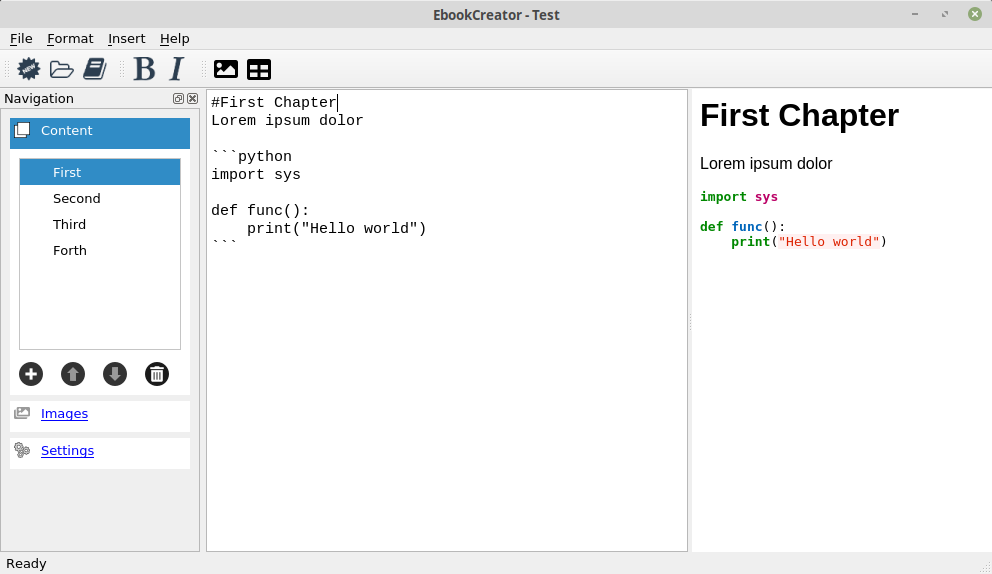

# EbookCreator
Easily create ebooks (epub) using markdown language.
The books are targetted towards Amazon Kindle. Therefore we don't support videos and sound.



Because of the fact that the program is written in Python using PyQt5 it should run on all mayor platforms.

If you have got a feature request don't hesitate to contact me at <artanidos@gmail.com>

## Prerequisits
In order to work with EbookCreator you have to install [Python 3.x](https://www.python.org/downloads/), [PIP3](https://stackoverflow.com/questions/6587507/how-to-install-pip-with-python-3) and the following packages.  
```console
pip3 install --user PyQt5
pip3 install --user Pygments
pip3 install --user autocorrect
pip3 install --user markdown2
pip3 install --user PyQtWebEngine
pip3 install --user markupsafe
pip3 install --user jinja2
pip3 install --user weasyprint
```
Also have a look at these instructions to install [weasyprint](https://weasyprint.readthedocs.io/en/latest/install.html).

## Additional installation
If you are getting an error like *Could not load the Qt platform plugin "xcb"* you should also install the following.
```console
sudo apt-get install --reinstall libxcb-xinerama0
```

## Basic Steps
To create a new book, press the "Plus" button and fill out the wizard.
A new book project will be saved under sources under the install directorylike:  
/home/user/Apps/EbookCreator/sources  
The book already has one part, or call it chapter if you like.  
Here you can type your story. 
If you want to place a heading which will be seen in the table of contents just use the "#" symbol at the beginning of a line.  
The main chapter is marked with one "#" like # Chapter 1.  
A sub-chapter is marked with two "#" like ## Chapter 1.1.  
The third level will be marked with three "#" like ### Chapter 1.1.1 and so on until you reach level 6.  

If you want to add a picture then just open the images tab, press the "+" button there to choose an image and double-click this image in the list to add it to your book at the last cursor position. The "AltText" and "Title" can be changed by hand.

The preview of the book can be seen on the right side of the application.

To export the book as epub just click the create button and choose a filename and a location. To keep all book in one place there is alread a books directory below the installation directory.
